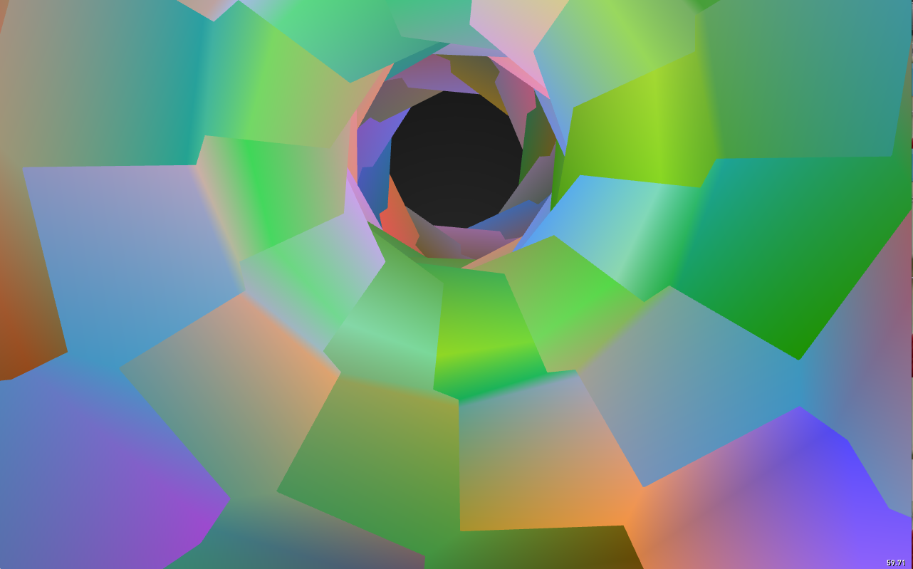
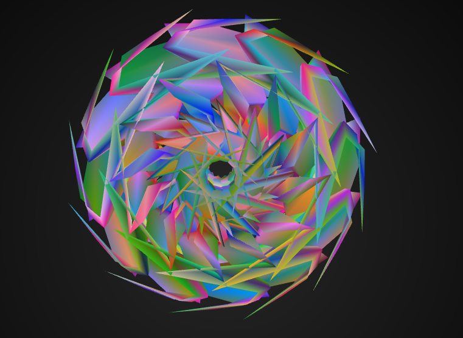

#Mesh Kaleidoscope 
This project takes multiple meshes into an ever adapting kaleidoscope that can be based off of noise or trigonometry depending on user preference. Their are also two perspectives to choose from (inner and outer). 

